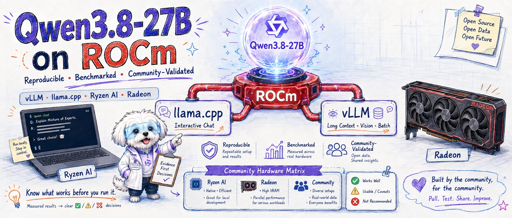

# Qwen3.8-27B-ROCm

[](https://github.com/AIwork4me/Qwen3.8-27B-ROCm/actions/workflows/ci.yml)
[](LICENSE)
[](https://github.com/AIwork4me/Qwen3.8-27B-ROCm/releases)

The reproducible, evidence-first reference for running
[Qwen/Qwen3.8-27B](https://modelscope.cn/models/Qwen/Qwen3.8-27B) on AMD
RDNA GPUs via ROCm — dual serving paths (vLLM + llama.cpp, HIP and Vulkan
backends), a 28-cell measured benchmark matrix with UX-first ✅/⚠️/❌
verdicts, and a community hardware-validation protocol.


Status: both serving paths (vLLM and llama.cpp/GGUF) validated on the
reference host — AMD Ryzen AI MAX+ PRO 395 / Radeon 8060S (`gfx1151`),
ROCm 7.14.0. W7900D (`gfx1100`) is community-validated (GGUF path, per the
hardware matrix below); more platforms are evidence-gated.

[Quick start](#quick-start-interactive-chat-the-gguf-path) ·
[Serving paths](#serving-paths) · [Hardware support](#hardware-support) ·
[Performance](#performance) · [Context capacity](#context-capacity) ·
[Known good / known bad](#known-good--known-bad) ·
[Documentation](#documentation) · [Status & roadmap](#status--roadmap) ·
[Contributing](#contributing) · [License](#license)

Prerequisites: a `gfx1151`-class AMD GPU (reference host: Ryzen AI MAX+
PRO 395 / 8060S), ROCm 7.14.0 (installer script provided), ~20 GiB disk
for the GGUF path (+~52 GiB for the vLLM BF16 path), git / curl / python3,
and ~26.5 GiB of GPU-visible memory (GTT) for the default boot at ctx
131072 — measured 26,548 MiB at load, and 29,270 MiB for the recommended
`WITH_MTP=1` boot (cell receipts `docs/results/matrix-714/cells/`). On
32 GiB-RAM hosts the GTT pool depends on BIOS/allocation — expect
pressure. Details in [Getting started](docs/getting-started.md).

## Quick start (interactive chat: the GGUF path)

The benchmark matrix (28 measured cells across the `hip` and `vulkan`
llama.cpp backends; verdicts in `configs/benchmark-verdicts.json`) puts
interactive chat on the GGUF path: every measured vLLM cell runs below the
10 tok/s interactive floor on this host — project ruling (2026-08-17); see
[Performance](#performance).

```bash
git clone https://github.com/AIwork4me/Qwen3.8-27B-ROCm.git && cd Qwen3.8-27B-ROCm
bash scripts/00-check-env.sh              # ROCm 7.14 at ~/rocm-7.14.0 or /opt/rocm
bash scripts/install-rocm-7.14.sh         # only if the check says so (1.6 GiB archive + 9 GiB extracted floor)
bash scripts/05-build-llama.sh            # pinned HIP build @ 4df29be4 for gfx1151 (compile ~7 min)
SET=gguf bash scripts/02-fetch-model.sh   # ~18 GiB, SHA256-verified against the manifest
WITH_MTP=1 SPEC_DEPTH=1 bash scripts/gguf-quickstart.sh  # recommended: MTP depth 1 — 13.86 tok/s per stream (2026-08-19 clean d1 pairing), on :8080
# a bare `WITH_MTP=1` (no SPEC_DEPTH) boots the implicit upstream depth 3 —
# the 13.0 tok/s corpus cell (`--help` on the script lists every knob)
# optional experimental backend opt-in (NOT recommended — downgraded
# 2026-08-19; the clean depth-1 pairing is +4.81% vs hip and the aggregate
# basis flips to -13.31%; see benchmark verdicts). The build needs 5 apt
# packages (mesa-vulkan-drivers vulkan-tools libvulkan-dev glslc
# spirv-headers) or the no-root VULKAN_DEPS_PREFIX fallback — see
# [troubleshooting: Vulkan build](docs/troubleshooting.md#vulkan-build):
#   bash scripts/06-build-llama-vulkan.sh
#   BACKEND=vulkan WITH_MTP=1 bash scripts/gguf-quickstart.sh
```

In a second terminal, verify (keep `max_tokens` ≥ 512: this model thinks
before answering; a low cap truncates it):

```bash
curl -s http://127.0.0.1:8080/health
curl -s http://127.0.0.1:8080/v1/chat/completions -H 'Content-Type: application/json' \
  -d '{"messages":[{"role":"user","content":"Reply with exactly: OK"}],"temperature":0,"max_tokens":512}'
```

Point any OpenAI-compatible client at `http://127.0.0.1:8080/v1`; Ctrl-C
stops the server.

| Boot | Per-stream speed |
|---|---|
| `bash scripts/gguf-quickstart.sh` (default: hip, UD-Q4_K_XL, ctx 131072) | 10.1 tok/s |
| `WITH_MTP=1 SPEC_DEPTH=1 bash scripts/gguf-quickstart.sh` (recommended — MTP depth 1) | 13.86 tok/s (2026-08-19 clean d1 pairing; [stability session 3](docs/results/matrix-714/stability/README.md)) |
| `WITH_MTP=1 bash scripts/gguf-quickstart.sh` (implicit depth 3, the upstream default) | 13.0 tok/s (+28% per-stream) — the corpus cell |
| `WITH_DFLASH2=1 bash scripts/gguf-quickstart.sh` (DFlash 2 drafter — needs [scripts/07-build-llama-dflash2.sh](scripts/07-build-llama-dflash2.sh) + `SET=dflash2 bash scripts/02-fetch-model.sh`) | gfx1100 host: **+13% vs base** single-stream / **+23% at c4** — measured on W7900-class gfx1100, lossless (greedy byte-identical); [DFlash 2 comparison](docs/results/dflash2/) |
| `BACKEND=vulkan WITH_MTP=1 bash scripts/gguf-quickstart.sh` (opt-in) | 16.0 tok/s (2026-08-18 cell) / 14.53 on the 2026-08-19 clean pairing (+4.81% vs hip, aggregate −13.31%) — available experimental opt-in, not recommended (project ruling 2026-08-19 supersedes 2026-08-18) |

Which serving path?

| You want | Use | Why |
|---|---|---|
| Interactive chat | `WITH_MTP=1 SPEC_DEPTH=1 bash scripts/gguf-quickstart.sh` (port 8080) — hip is both the default and the recommended path (`BACKEND=vulkan` exists as an experimental opt-in, not recommended) | every measured vLLM cell is below the 10 tok/s interactive floor |
| 262144-token context, vision, or aggregate batch throughput (to 38.6 tok/s) | `bash scripts/03-serve-vllm.sh` (port 8000) | the greedy-degradation-free path, but not interactive on this host |
| Multi-user GGUF loads | Don't | greedy-degradation pit on hip — see [Known good / known bad](#known-good--known-bad) |

Measured (2026-08-18, v0.1.2 rider): unified-default-boot c4 at ctx 131072
(the stock quickstart's 4-slot default under 4 concurrent users) runs at
6.7 tok/s healthy-stream median vs 7.5 for the split boot (`-np 4`) —
3-of-4 streams stopped early, so the unified default boot degrades
interactivity; single-stream use is unaffected.

## Serving paths

| Path | Status (`gfx1151`, ROCm 7.14) | Evidence |
| --- | --- | --- |
| vLLM (source build @ `4d2a68d`, BF16) | Validated — text, MTP speculative decoding, 262144 context, and single-small-image vision; encoder-peak memory for larger image workloads is unbudgeted under `--skip-mm-profiling` | `docs/results/rocm-7.14/vllm-validation.md` |
| llama.cpp / GGUF (HIP build @ `4df29be`, UD-Q4_K_XL) | Validated — text (greedy smoke at ctx 131072), MTP via `--spec-type draft-mtp`, and single-small-image vision via mmproj-F16; `CTX_SIZE=262144` boots but total GTT grows to 33.9 GiB (weights + KV; the 262144 KV increment is 8.0 GiB over the 131072 boot), so the validated default stays 131072 | `docs/results/rocm-7.14/gguf-validation.md` |

## Hardware support

<!-- BEGIN GENERATED: hardware-matrix -->
| Platform | GPU arch | Memory model | Stack | Status | Evidence |
|---|---|---|---|---|---|
| AMD Ryzen AI MAX+ PRO 395 / Radeon 8060S (reference host) | `gfx1151` | 80 GiB unified GTT pool | ROCm 7.14.0 — vLLM @`4d2a68d`, llama.cpp @`4df29be` | ✅ Project-validated | [vLLM](docs/results/rocm-7.14/vllm-validation.md), [GGUF](docs/results/rocm-7.14/gguf-validation.md) |
| AMD Radeon Pro W7900D | `gfx1100` | 48 GiB discrete VRAM (submitter's rocm-smi) | ROCm 7.2.1 (kernel 6.8.0-79-generic) — submitter stack, see docs/hardware-validation.md | 🧪 Community validated — GGUF | [env-check.txt](docs/results/matrix-714/community/w7900d-gfx1100-rocm721/env-check.txt), [w7900d-gfx1100-rocm721](docs/results/matrix-714/community/w7900d-gfx1100-rocm721/) |

✅ project-validated on the reference host; 🧪 community-validated — a submitter's receipts, schema-checked and reviewed per [docs/hardware-validation.md](docs/hardware-validation.md); 🚧 planned — invited, no evidence yet. Community status never changes project verdicts or quickstart defaults (`configs/community/` and the community receipts tree are a separate namespace).
<!-- END GENERATED: hardware-matrix -->

## Performance

<!-- BEGIN GENERATED: performance-highlights -->
Measured 2026-08-16 and 2026-08-18 on the reference host (gfx1151, ROCm 7.14, 80 GiB GTT pool): **28 cells — 8 recommended / 14 caution / 6 avoid**. Verdicts: `configs/benchmark-verdicts.json`; raw receipts: `docs/results/matrix-714/cells/`; full tables: `docs/results/benchmark.md`.

**Recommended — interactive chat (GGUF path, UD-Q4_K_XL):**

| Config | Backend | Per-stream (median) | Aggregate | TTFT | Cell verdict | Quickstart mapping |
|---|---|---|---|---|---|---|
| `BACKEND=vulkan` + `WITH_MTP=1` mtp-c1 @131072 — available experimental opt-in, NOT recommended (project ruling 2026-08-19 supersedes the 2026-08-18 promotion: clean d1 pairing +4.81% — the conservative FLOOR case, vk measured in the unidentified slow state — aggregate -13.31%; variance decomposed v0.1.7: cold-cache swing BOUND +38% (cold 12.38 / warm 16.96–17.10 tok/s) but s3's cache was forensically INTACT — vk-specific trigger UNIDENTIFIED; common-mode drift ±5–6% (s5 vs s4: vk -4.6%, hip -6.0%); warm pairing band 4 sessions +15.88%/+20.61%/+19.90%/+15.93% incl. overnight persistence (s6 7 h 50 m after s5, cache byte-identical); aggregate/TTFT hip-favored)) | vulkan | 16.0 tok/s (TPOT 62.5 ms) | 10.4 tok/s | 8.6 s | ✅ recommended | **NOT recommended** — available experimental opt-in (downgraded 2026-08-19) |
| `WITH_MTP=1` mtp-c1 @131072 — +28% per-stream (the corpus cell ran implicit depth 3, predating the depth flag; re-running it today pins depth 1 explicitly via SPEC_DEPTH=1 and measures ~13.86 — session 3 2026-08-19, `matrix-714/stability/session3-2026-08-19/`) | hip | 13.0 tok/s (TPOT 76.9 ms) | 10.2 tok/s | 5.5 s | ✅ recommended | **recommended path** — boot as `WITH_MTP=1 SPEC_DEPTH=1` |
| default boot base-c1 @131072 | hip | 10.1 tok/s (TPOT 98.6 ms) | 8.4 tok/s | 5.1 s | ✅ recommended | the default boot |
| base-c1 @32768 | hip | 10.0 tok/s (TPOT 99.6 ms) | 8.3 tok/s | 5.3 s | ✅ recommended | via `CTX_SIZE=32768` |
| base-c1 @262144 (GTT +8.0 GiB) | hip | 10.1 tok/s (TPOT 98.8 ms) | 8.4 tok/s | 5.3 s | ✅ recommended | via `CTX_SIZE=262144` |

**Caution — batch / throughput (vLLM BF16 @262144):** every measured vLLM cell is below the 10 tok/s interactive floor — project ruling (2026-08-17); use this path for what it wins:

| Config | Per-stream (median, min) | Aggregate | Verdict |
|---|---|---|---|
| base-c16-ctx262144 | 3.0 (min 2.58) tok/s | 38.6 tok/s | ⚠️ caution — best batch cell measured |
| mtp-c8-ctx262144 | 4.2 (min 3.47) tok/s | 24.7 tok/s | ⚠️ caution — MTP beneficial through c8 |
| mtp-c1-ctx262144 | 6.5 tok/s | 5.8 tok/s | ⚠️ caution — +52.6% per-stream vs base (+45.5% aggregate, basis labeled in the verdict) |

**Honesty clause (aggregate never headlines over UX):** the best aggregate on this host — vLLM base-c16, 38.6 tok/s — runs each stream at 3.0 tok/s median (min 2.58): batch presentation only. GGUF-hip c8/c16 aggregates (to 27.5 tok/s) are ❌ avoid cells — greedy decoding degrades after sustained multistream load (see Known good / known bad; the pit does NOT reproduce on Vulkan, whose c8/c16 tiers are unmeasured). Interactive chat → GGUF `WITH_MTP=1` on the default hip backend (13.0 tok/s per stream — the recommended path). `BACKEND=vulkan` remains an available experimental opt-in, NOT a recommendation (project ruling 2026-08-19 supersedes the 2026-08-18 promotion: the clean d1 pairing is 14.53 vs 13.86 tok/s, +4.81% — the conservative FLOOR case, vk measured in the unidentified slow state — aggregate -13.31%; the variance is decomposed v0.1.7: the cold-cache swing +38% is the BOUND (cold 12.38 / warm 16.96–17.10 tok/s), s3's cache was forensically INTACT so its vk-specific trigger is UNIDENTIFIED, common-mode drift is ±5–6%, and the warm pairing band spans 4 sessions (+15.88%/+20.61%/+19.90%/+15.93% incl. overnight persistence) while aggregate/TTFT stay hip-favored) — see the verdicts).
<!-- END GENERATED: performance-highlights -->

## DFlash 2 speculative decoding (opt-in, with/without measured)

**What changes:** one switch — `WITH_DFLASH2=1` — attaches the
[DFlash 2](https://huggingface.co/incoai/Qwen3.8-27B-DFlash2) block-diffusion
drafter (~1.9 B, Q8_0 2.0 GiB) and turns on `--spec-type draft-dflash
--spec-draft-n-max 7` (7 = the checkpoint's `block_size 8 − 1`). Decoding
is **lossless** — verified on-host by greedy byte-identity
([`equiv.json`](docs/results/dflash2/equiv.json), 4/4 prompts identical).
Every default boot (no `WITH_DFLASH2`) is byte-identical to before.

**With vs without, measured 2026-08-21 on a W7900-class `gfx1100` host
(48 GiB, ROCm 7.2.1, llama.cpp PR
[#27342](https://github.com/ggml-org/llama.cpp/pull/27342) build — the
SAME binary served both arms; UD-Q4_K_XL @ ctx 131072):**

| Boot | c=1 per-stream | c=4 per-stream (median) | TTFT c=1 | VRAM |
|---|---:|---:|---:|---:|
| without DFlash2 (baseline) | 29.4 tok/s | 17.3 tok/s | 1.87 s | 25.9 GiB |
| `WITH_DFLASH2=1` | 33.2 tok/s (**+12.9%**) | 21.4 tok/s (**+23.4%**) | 2.29 s | 32.6 GiB |
| `WITH_MTP=1 SPEC_DEPTH=1` (context arm) | 41.3 tok/s (+40.5%) | — | 2.06 s | 27.4 GiB |

Read this honestly: the vendor tables (2.7–3.4× on H200/SGLang, 1.8× on
M5 Pro/llama.cpp) did **not** transfer to this compute-limited card —
draft acceptance measured 0.36 on the project bench vs ≈ 5/7 on the
vendor's reasoning-heavy evals, and every 8-token verification step costs
more here. On THIS host class the built-in MTP head at depth 1 remains
the faster single-stream choice; DFlash2's measured case is multi-stream
(c4) and its losslessness is proven. Full analysis, the c16 probe (the
DFlash v1 `-np 16` hang does NOT reproduce on v2) and raw receipts:
[docs/results/dflash2/](docs/results/dflash2/).

```bash
bash scripts/07-build-llama-dflash2.sh        # once: PR #27342 HIP build (GPU arch auto-detected)
SET=dflash2 bash scripts/02-fetch-model.sh    # once: draft GGUF, SHA256-verified (ModelScope)
WITH_DFLASH2=1 bash scripts/gguf-quickstart.sh    # serving on :8080 — same client, same answers, faster
```

Knobs & traps: `DFLASH_FILE` (Q4_K_M 1.1 GiB if VRAM-tight), `SPEC_DEPTH`
(draft length, hard cap 7 — requesting more is refused, upstream clamps
it anyway), mutually exclusive with `WITH_MTP`; the build is an
**unmerged PR** pinned in
[`configs/validated-stack.json`](configs/validated-stack.json)
(`llama_cpp_dflash2`) — see
[troubleshooting: DFlash2](docs/troubleshooting.md#dflash2-pr-build).

## Context capacity

<!-- BEGIN GENERATED: context-capacity -->
Boot ladder (S3) + deep-prompt retrieval smoke — GGUF path, needle sentence at ~80% depth, judged by exact substring recall (`docs/results/matrix-714/long-context-smoke.json`):

| Path | Tier | Boots | GTT at load | Retrieval @~80% depth | Cell verdicts |
|---|---|---|---|---|---|
| gguf | 32768 | OK (14.0 s) | 20,406 MiB | PASS @ 29,614 prompt tokens (TTFT 137.4 s) | base-c1 ✅ (base-c4-ctx32768 ❌ — greedy pit) |
| gguf | 131072 | OK (4.0 s) | 26,546 MiB | **FAIL — confident miss** (answered "No validation codename is mentioned in the documents.", finish_reason=stop) @ 120,305 prompt tokens (TTFT 1012.1 s) | c1 base/mtp ✅; c4 ⚠️ (below floor); c8/c16 ❌ (greedy pit) |
| gguf | 262144 | OK (6.0 s) | 34,736 MiB | PASS @ 247,232 prompt tokens (TTFT 3457.3 s) | base-c1 ✅ (+8.0 GiB GTT); base-c4 ⚠️ (below floor) |
| vllm | 262144 | OK (171 s) | 75,040 MiB (weights 51.1, KV 19.57 GiB) | not run on this path | 8 cells ⚠️/❌ per the 2026-08-17 ruling (mtp-c16 ❌) |

**`max_usable_context`, honestly:** every tier boots on the GGUF path, but functional retrieval is **non-monotonic in depth** — 30K PASS, 120K confident miss, 247K PASS (one needle, one depth, one seed) — so a reliable max_usable_context for deep-prompt retrieval is **not established above ~30K** by this smoke; treat deep-context answers as unverified until re-tested (METHODOLOGY §1 ruling).

**KV ceilings:** GGUF KV grows 64 KiB/token bf16 — +8.0 GiB per 131,072 tokens, the closed form confirmed by the GTT ladder (26,548 → 34,742 MiB). vLLM @262144 budgets KV 19.57 GiB = 313,650 tokens (1.20x max-len; MTP: 18.59 GiB, 279,146 tokens, 1.06x) — **a single full-depth request fits; two concurrent full-depth streams do not** (deep-context concurrency is KV-budget-bound long before `max_num_seqs`).
<!-- END GENERATED: context-capacity -->

## Known good / known bad

<!-- BEGIN GENERATED: known-good-bad -->
**Known good** (verdict receipts in `configs/benchmark-verdicts.json`):

- ✅ **GGUF interactive at c1** — hip: all three ctx tiers recommended, default boot (10.1 tok/s per stream) and `WITH_MTP=1` (13.0 tok/s, +28% per-stream) — the recommended path; vulkan (experimental opt-in): base 10.7 and mtp 16.0 tok/s in the 2026-08-18 cells (see the Vulkan bullet for the downgraded mapping).
- ✅ **vLLM path anchor-clean in all 8 cells** — including anchors run immediately after 16-stream benches: the GGUF greedy-degradation pit does NOT reproduce here; the honest choice for 262144 context, vision, and batch throughput (38.6 tok/s aggregate @base-c16).
- ✅ **Vulkan backend (v0.1.2 cells; opt-in downgraded v0.1.4, variance decomposed v0.1.7)** — anchor-clean in all 6 measured vulkan cells (the hip greedy pit does NOT reproduce on this backend; cell-run anchors now 19/19 across s1–s6). `BACKEND=vulkan WITH_MTP=1` is an AVAILABLE experimental opt-in, NOT a recommendation — project ruling 2026-08-19 SUPERSEDES the 2026-08-18 promotion (mixed-depth basis): the clean d1 pairing (2026-08-19) is 14.53 vs 13.86 tok/s = +4.81% single-stream (the conservative FLOOR case — vk measured in the unidentified slow state), aggregate flips to -13.31% (vulkan TTFT 9.94–12.21 s vs 8.36–8.83 s on 08-18), and cross-day re-runs dropped every vulkan cell (spreads 11.81%/30.70%/6.07% mtp/mtp4/base) — v0.1.6 root-caused that class to Mesa shader-cache state (identical config/flags/pin measures cold 12.38 with the cache aside / warm 16.96–17.10 tok/s, mean 17.03 = a +38% cold→warm swing), and v0.1.7's trigger-hunt forensics refine it (dated supersession #3): the cache was forensically INTACT at s3 (`matrix-714/stability/trigger-hunt-2026-08-19.md` — 866 files pre-window / 0 written inside the causal window / 1 post), so the partial-cold reading is retired: s3 ran slow with a warm untouched cache and its vk-specific TRIGGER is UNIDENTIFIED (no suspend/resume, no amdgpu reset/errors, no power-profile switch in the window; clock-stepping absent during s3's run; the only discrete in-window state change is an unattended-upgrade linux-libc-dev/linux-tools-common 6.8.0-137→138 — fact recorded, no mechanism claimed); clock-stepping is a CHRONIC common-mode condition (883+ events since the 08-12 boot, present during fast sessions too — not s3-specific). Session-5/6 series: BOTH backends drift together evening vs morning (vk -4.6%, hip -6.0% vs s4 — common-mode ±5–6%), the warm pairing band is 4 sessions +15.88%/+20.61%/+19.90%/+15.93% (s4 boots 1-2, s5, s6), OVERNIGHT persistence is confirmed (s6 7 h 50 m after s5, cache byte-identical 7884 KiB/867 files / zero writes, pairing in band), and aggregate/TTFT are consistently hip-favored (TTFT vk 8.49–8.54 vs hip 5.49–5.63 s across s5/s6; aggregate s5 +1.07%, s6 -2.39%) — vulkan's edge is the single-stream median only. hip `WITH_MTP=1` is BOTH the default and the recommended path (recommendation unchanged by every refinement). Evidence: `docs/results/matrix-714/stability/`; one host / one ICD (RADV 25.2.8) remain the limits. Selection guidance (owner ruling 2026-08-20 — self-selection criteria, NOT a recommendation): self-select the opt-in for long outputs (≳300-token replies; crossover ≈230–310 tokens (derived) — where the warm streaming band (+15.88%/+20.61%/+19.90%/+15.93%) repays the ~3 s slower first token: TTFT vk 8.49–8.54 vs hip 5.49–5.63 s) or power-sensitive setups (package power ~30–32 W vs ~52–53 W on hip); short-reply interactive users get no end-to-end benefit and a slower first token — see `docs/adaptation.md` §Vulkan (the four pre-registered promotion criteria: README roadmap decision entry).
- ✅ **Boot reliability** — every declared-priority cell booted (GGUF 4–6 s warm; vLLM 171/226 s); zero failed streams across all 28 cells.

**Known bad / pits:**

- ❌ `gguf-hip-udq4kxl-auto-base-c16-ctx131072` — greedy `'////'` corruption after sustained multistream load (per-stream median 3.2 tok/s, aggregate 27.5 tok/s). Workaround: restart the server; multi-stream loads → vLLM.
- ❌ `gguf-hip-udq4kxl-auto-base-c4-ctx32768` — greedy `'////'` corruption after sustained multistream load (per-stream median 5.8 tok/s, aggregate 15.7 tok/s). Workaround: restart the server; multi-stream loads → vLLM.
- ❌ `gguf-hip-udq4kxl-auto-base-c8-ctx131072` — greedy `'////'` corruption after sustained multistream load (per-stream median 3.6 tok/s, aggregate 18.4 tok/s). Workaround: restart the server; multi-stream loads → vLLM.
- ❌ `gguf-hip-udq4kxl-auto-mtp-c16-ctx131072` — greedy `'////'` corruption after sustained multistream load (per-stream median 1.4 tok/s, aggregate 16.3 tok/s). Workaround: restart the server; multi-stream loads → vLLM.
- ❌ `gguf-hip-udq4kxl-auto-mtp-c8-ctx131072` — greedy `'////'` corruption after sustained multistream load (per-stream median 2.1 tok/s, aggregate 10.7 tok/s). Workaround: restart the server; multi-stream loads → vLLM.

**Upstream tracking (shared by the 5 greedy-pit cells):** live at llama.cpp master HEAD 01818e495 (2026-08-17); candidate fix PR #25863 https://github.com/ggml-org/llama.cpp/pull/25863 differentially verified on this host (patched 2/2 anchor PASS vs unpatched 3/3 FAIL idle-host; receipts docs/results/upstream-controls/); tracked in #25992 https://github.com/ggml-org/llama.cpp/issues/25992 (primary — same-host bisect, maintainer invited testing) and #23577 https://github.com/ggml-org/llama.cpp/issues/23577 (////-family); exact mechanism unresolved at session close (METHODOLOGY §6).

- ❌ `vllm-bf16-auto-mtp-c16-ctx262144` — MTP regresses vs baseline at c16 (31.1 vs 38.6 tok/s aggregate, per-stream min 1.85 tok/s); serve without `--mtp` at high concurrency.
- ⚠️ **vLLM encoder profiling** — boot OOMs at `--max-model-len 262144` without `--skip-mm-profiling` (ViT dummy batch scales with max_model_len; attempted allocation 256 GiB vs the 80 GiB pool). The flag is mandatory — and with it the encoder activation peak is unbudgeted: the operator budgets image traffic (`docs/results/rocm-7.14/vllm-validation.md` ## Vision).
- ⚠️ **GGUF ctx 262144 GTT growth** — +8.0 GiB over the 131072 boot (34,742 vs 26,548 MiB; 64 KiB/token bf16 KV): capacity-OK, caution-grade — fits the 80 GiB pool with headroom.
- ⚠️ **vLLM KV ceiling at 262144** — KV 19.57 GiB = 313,650 tokens (1.20x max-len; MTP 1.06x): one full-depth stream fits, two don't.
- ⚠️ **Deep-context retrieval (GGUF)** — 120K tier returned a confident miss; non-monotonic vs depth, unverified above ~30K (see Context capacity).
- ⚠️ **Unified default boot under concurrent users (GGUF, v0.1.2 rider)** — the stock quickstart's 4-slot unified boot at ctx 131072 with 4 concurrent users degrades interactivity vs the split boot: 6.7 vs 7.5 tok/s healthy-median, aggregate 5.0 vs 9.4 (3-of-4 streams early-EOS; single-stream use unaffected — see the rider verdict).

Every verdict with its full reason/conditions/workaround: `configs/benchmark-verdicts.json`.
<!-- END GENERATED: known-good-bad -->

Full tables with links to the raw receipts: [docs/results/benchmark.md](docs/results/benchmark.md).

## Documentation

- [Getting started](docs/getting-started.md) — prerequisites, disk budget, both serving paths with the exact validated commands
- [Troubleshooting](docs/troubleshooting.md) — every measured pit in the standard symptom → repro → diagnosis → workaround → upstream format
- [Adaptation map](docs/adaptation.md) — MI-series/Day-0 → RDNA gfx1151 deltas, classified by durability
- [Results index](docs/results/README.md) — one line per validation track (spike, receipts, matrix, method)
- [Hardware validation protocol](docs/hardware-validation.md) — adding other AMD GPUs as community evidence
- [Design spec (project internals)](docs/superpowers/specs/2026-08-16-qwen3.8-27b-rocm-design.md) — the design decisions behind this repository

## Status & roadmap

Current release: **v0.1.9** — DFlash 2 speculative decoding (opt-in,
measured with/without on gfx1100) — [CHANGELOG](CHANGELOG.md) ·
[Releases](https://github.com/AIwork4me/Qwen3.8-27B-ROCm/releases).

Roadmap — evidence-gated intentions, not promises; each item lands when its
receipts do:

- **vLLM path on community platforms** (W7900-class `gfx1100`): the
  reference vLLM stack is gfx1151-only (the TheRock nightly index has no
  gfx1100 builds), so submissions bring and document their own stack — the
  [protocol](docs/hardware-validation.md) is ready for it.
- **Vulkan-vs-HIP + MTP depth — answered (v0.1.2), re-based (v0.1.4),
  cross-day variance root-caused (v0.1.6), decomposed (v0.1.7)** —
  AMD's Day-0 anchor for this model class is 24.5 tok/s (llama.cpp/Vulkan
  with MTP=4 on a 128 GB Ryzen AI Max+ 395 host, where MTP-off was faster
  at 39.9 tok/s; spike receipt:
  [docs/results/spike/vllm.md](docs/results/spike/vllm.md)) vs our
  13.0 tok/s per stream (HIP, MTP=1, on the 80 GiB pool). The v0.1.2
  headline (Vulkan+MTP depth-1 at 16.0 tok/s, +23% over hip) was
  mixed-depth; the 2026-08-19 clean depth-1 pairing re-bases it — vulkan
  14.53 vs hip 13.86 tok/s (+4.81%), aggregate basis flipped (−13.31%) —
  so `BACKEND=vulkan` is an available experimental opt-in, not a
  recommendation (hip `WITH_MTP=1` is both the default and the
  recommended path); depth-4 never beats depth-1 on either backend
  (vulkan 15.05, hip 12.76). The cross-day variance is now decomposed
  (v0.1.7): the cold-cache swing bound (+38%), a common-mode ±5–6%
  session drift, and one unexplained vk-specific slow run (s3 — cache
  forensically intact). Neither backend nor depth closes the gap to
  24.5 on an 80 GiB host ([adaptation map](docs/adaptation.md), [benchmark
  tables](docs/results/benchmark.md), [stability
  receipts](docs/results/matrix-714/stability/)).
- **Re-recommend `BACKEND=vulkan`? — DECIDED 2026-08-20: NO (owner
  ruling; stays experimental opt-in)** — the repository owner closed the
  v0.1.7 OPEN question: NOT re-recommending vulkan; it stays an
  available experimental opt-in, NOT recommended, and hip
  `WITH_MTP=1 SPEC_DEPTH=1` stays BOTH the default AND the recommended
  path (the mapping of record is confirmed, not changed). Rationale
  (verifier-locked evidence; arithmetic in [adaptation
  map](docs/adaptation.md) §Vulkan "Choosing the backend"):
  end-to-end latency parity at typical reply lengths — vk's TTFT is
  consistently ~3 s higher (8.4–8.6 vs 5.4–5.6 s), offsetting the warm
  streaming band (+15.88/+20.61/+19.90/+15.93% across 4 sessions);
  derived crossover ≈230–310 tokens (derived — arithmetic over the
  s4/s5/s6 receipts, not a measurement); the cold-cache first boot
  (12.38 tok/s, TTFT 12.45 s — worse than default hip on both) is the
  state a recommendation would systematically deliver to new users
  first; 1-of-7 runs hit the unexplained slow state (s3 14.53, trigger
  unidentified after forensics); single-host / single-ICD (RADV 25.2.8)
  / single-Mesa-point / 2-days evidence base. Selection guidance
  (self-selection, not promotion): self-select for long outputs
  (≳300-token replies) or power-sensitive setups (vk ~30–32 W vs hip
  ~52–53 W package); short-reply interactive users get no end-to-end
  benefit and a slower first token. Pre-registered promotion criteria —
  ALL four must hold before any future upgrade to
  conditional-recommended:
  (1) a daily warm series of at least 7 days with ZERO slow-state recurrence;
  (2) the vk c8/c16 cells measured with anchors clean (pit coverage — currently unmeasured);
  (3) at least one independent host/ICD replication (a community submission is ideal);
  (4) the TTFT gap stated as an applicability condition (long-generation only), not a footnote.
  History: the v0.1.7
  both-ways restatement (FOR: 4-session warm band + proven overnight
  persistence; AGAINST: s3 trigger unexplained, aggregate/TTFT
  hip-favored) stays visible in the ruling note
  ([verdicts](configs/benchmark-verdicts.json)) and
  [CHANGELOG](CHANGELOG.md). Numbers and links: [adaptation
  map](docs/adaptation.md) §Vulkan, [stability
  receipts](docs/results/matrix-714/stability/),
  [verdicts](configs/benchmark-verdicts.json).
- **The bracketing gap — filled (v0.1.2)** — the unified-default c4@131072
  cell is measured (rider): 6.7 tok/s healthy-stream median vs 7.5
  split-mode — unified default boot degrades interactivity; no config
  change (the Quick start note).
- **The remaining planned matrix cells** — 20 of the matrix's 56 declared
  cells are still `planned` (8 more are dropped unsupported tiers);
  `docs/results/matrix-714/matrix.json` is the ledger.
- **More community platforms** — the invitation is open for any AMD gfx
  arch via the [validation protocol](docs/hardware-validation.md); the
  matrix lists only evidenced platforms (the W7900/`gfx1100` 🚧 placeholder
  was superseded by the community W7900D 🧪 row in v0.1.1 — the open ask
  there is the vLLM path, first bullet). See
  [Hardware support](#hardware-support).

## Contributing

The primary ask is hardware evidence: follow the
[hardware-validation protocol](docs/hardware-validation.md) and file the
[hardware-validation issue form](https://github.com/AIwork4me/Qwen3.8-27B-ROCm/issues/new?template=hardware-validation.yml).
For code and docs — evidence-first rules, generated blocks, the local
test/gate loop — see [CONTRIBUTING.md](CONTRIBUTING.md).

## License

Repository code and docs are [Apache-2.0](LICENSE). The
[Qwen/Qwen3.8-27B](https://modelscope.cn/models/Qwen/Qwen3.8-27B) model
artifacts are governed by their own license — check the model repository
before downloading; this repository does not redistribute them.
